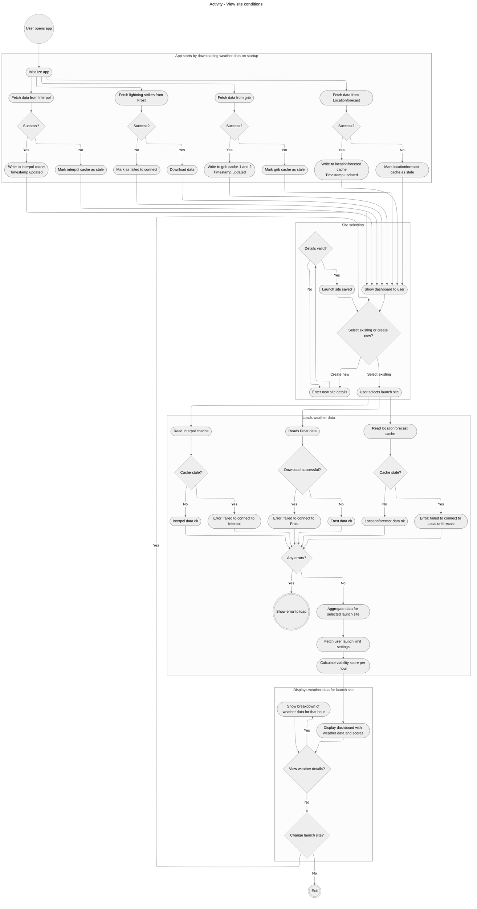

```mermaid
---
title: Activity - View site conditions
config:
    layout: elk
    look: classic
    theme: neutral
---
    flowchart TD

        start((User opens app))
        init([Initialize app])
        interpol([Fetch data from Interpol])
        locationforecast([Fetch data from Locationforecast])
        grib([Fetch data from grib])
        frost([Fetch lightning strikes from Frost])
        s1{Success?}
        s2{Success?}
        s3{Success?}
        s4{Success?}
        interpolSucc([Write to interpol cache\nTimestamp updated])
        interpolFail([Mark interpol cache as stale])
        locationforecastSucc([Write to locationforecast cache\nTimestamp updated])
        locationforecastFail([Mark locationforecast cache as stale])
        gribSucc([Write to grib cache 1 and 2\nTimestamp updated])
        gribFail([Mark grib cache as stale])
        frostSucc([Download data])
        frostFail([Mark as failed to connect])
        dashboard([Show dashboard to user])
        userSelection{Select existing or create new?}
        siteDetails([Enter new site details])
        detailsValid{Details valid?}
        savesSite([Launch site saved])
        selects([User selects launch site])
        rInterpol([Read Interpol chache])
        inteprolStale{Cache stale?}
        rLocatinforecast([Read locationforecast cache])
        locationforecastStale{Cache stale?}
        rFrost([Reads Frost data])
        frostStale{Download successful?}
        ok1([Interpol data ok])
        ok2([Locationforecast data ok])
        ok3([Frost data ok])
        e1([Error: failed to connect to Interpol])
        e2([Error: failed to connect to Locationforecast])
        e3([Error: failed to connect to Frost])
        staleCahces{Any errors?}
        errorEnd(((Show error to load)))
        compoundData([Aggregate data for selected launch site])
        settings([Fetch user launch limit settings])
        calculateScore([Calculate viability score per hour])
        dashboardDetails([Display dashboard with weather data and scores])
        viewDetails{View weather details?}
        breakdown([Show breakdown of weather data for that hour])
        changeSite{Change launch site?}
        slutt(((Exit)))

        start --> init

        subgraph Startup[App starts by downloading weather data on startup]
            init --> interpol & grib & locationforecast & frost
            interpol --> s1
            s1 -- Yes --> interpolSucc
            s1 -- No -->interpolFail
            grib --> s2
            s2 -- Yes --> gribSucc
            s2 -- No --> gribFail
            locationforecast --> s3
            s3 -- Yes --> locationforecastSucc
            s3 -- No --> locationforecastFail
            frost --> s4
            s4 -- Yes --> frostSucc
            s4 -- No -->frostFail
        end

        interpolSucc & interpolFail & gribSucc & gribFail & locationforecastSucc & locationforecastFail & frostSucc & frostFail --> dashboard
        
        subgraph siteselection[Site selection]
            dashboard --> userSelection
            userSelection -- Select existing --> selects
            userSelection -- Create new --> siteDetails
            siteDetails --> detailsValid
            detailsValid -- Yes --> savesSite
            detailsValid -- No --> siteDetails
            savesSite --> userSelection
        end

        subgraph loadData[Loads weather data]
            selects --> rInterpol & rLocatinforecast & rFrost
            rInterpol --> inteprolStale
            rLocatinforecast --> locationforecastStale
            rFrost --> frostStale
            inteprolStale -- No --> ok1
            inteprolStale -- Yes --> e1
            locationforecastStale -- No --> ok2
            locationforecastStale -- Yes --> e2
            frostStale -- No --> ok3
            frostStale -- Yes --> e3
            ok1 & e1 & ok2 & e2 & ok3 & e3 --> staleCahces
            staleCahces -- Yes --> errorEnd
            staleCahces -- No --> compoundData
            compoundData --> settings
            settings --> calculateScore
        end

        subgraph displayData[Displays weather data for launch site]
            calculateScore --> dashboardDetails
            dashboardDetails --> viewDetails
            viewDetails -- Yes --> breakdown
            breakdown --> viewDetails
            viewDetails -- No --> changeSite
            changeSite -- Yes --> userSelection
        end
        changeSite -- No --> slutt

```