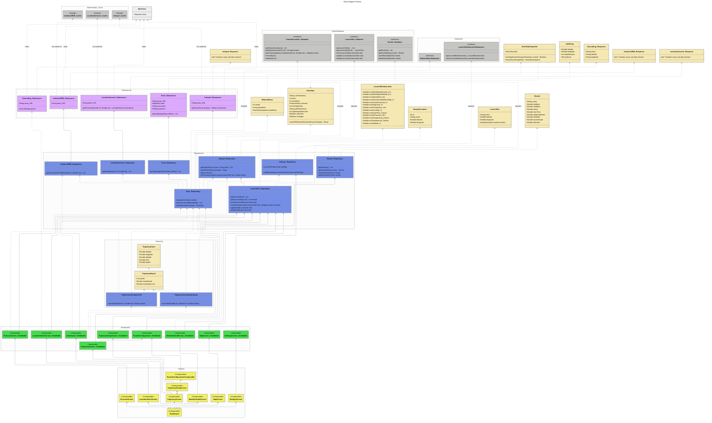

```mermaid
---
title: Class Diagram Paralax
config:
    layout: elk
    look: classic
    theme: neutral
    class:
        hideEmptyMembersBox: true
---
classDiagram
  
    class MetClient {
        +Httpclient client
    }
    namespace Weatherdata_Cache {
        class Locationforecast_Cache:::storage {
            <<storage>>
        }
        class Interpol_Cache:::storage {
            <<storage>>
        }
        class IsobaricGRIB_Cache:::storage {
            <<storage>>
        }
    }
    namespace RoomDatabase {
        class LaunchSite_Database:::storage {
            <<interface>>
            +getLaunchSites() : List<Launchsites>
            +getLaunchsite(Int id) : LaunchSite
            +insertLaunchSite(Launchsite site)
            +updateLaunchsite(Launchsite site)
            +deleteLaunchsite(Launchsite site)
        }
        class Rocket_Database:::storage {
            <<interface>>
            getRockets() List<Rocket>
            getRocket(String name) Rocket
            insertRocket(Rocket rocket)
            deleteRocket(Rocket rocket)
        }
        class InterpolLocation_Database:::storage {
            <<interface>>
            +getInterpolLocations() List<InterpolLocation>
            +getInterpolLocation(Int id) InterpolLocation
            +getClosestInterpolLocation(Double lat, Double lon) InterpolLocation
            +insertAll(List<InterpolLocation>)
            +deleteAll(List<InterpolLocation>)
        }
    }
    
    namespace Datastores {
        class WatchedHourDatastore:::storage{
            <<interface>>
        }
        class LaunchWindowLimitsDatastore:::storage {
            <<interface>>
            +getLaunchWindowLimits() LaunchWindowLimits
            +saveLaunchWindowLimits(LaunchWindowLimits)
        }
    }

    namespace Datasources {
        class Interpol_Datasource:::datasource {
            +String base_URL
            +getData(Sring location) Interpol_Response
        }
        class IsobaricGRIB_Datasource:::datasource {
            +String base_URL
        }
        class Frost_Datasource:::datasource {
            +String base_URL
            +Httpclient client
            +String username
            +String password
            +getLightning(String reftime) List<Lightning>
        }
        class Locationforecast_Datasource:::datasource {
            +String base_URL
            +getForecast(Double lat, Double lon) Locationforecast_Response
        }
        class Geocoding_Datasource:::datasource {
            +String base_URL
            +search(String query)
        }
    }


    namespace Repositories {
        class Interpol_Repository:::repository {
            +getData(String location, String time) List<InterpolUnits>
            +getAllData(String location) Map<String,List<InterpolUnits>>
            +getLocations()
            +linkClosestInterpolLocation(LaunchSite site, Double delta)
        }
        class IsobaricGRIB_Repository:::repository {
            getAtmosphericProfile(Double lat, Double lon) List<AtmosphericLayer>
        }
        class Locationforecast_Repository:::repository {
            +getData(Double lat, Double lon) List<ForecastEntry>
        }
        class Frost_Repository:::repository {
            +getLightningStrikes(String reftime) List<Lightning>
        }
        class LaunchSite_Repository:::repository {
            +getLaunchSites() List<Launchsite>
            +getLaunchSite(Int id) Launchsite
            +insertLaunchSite(Launchsite site)
            +insertInterpolLocation(Launchsite site, InterpolLocation location)
            +updateSite(Launchsite site)
            +deleteSite(Launchsite site)
        }
        class Rocket_Repository:::repository {
            +getRockets() List<Rocket>
            +getRocket(String name) Rocket
            +insertRocket(Rocket rocket)
            +deleteRocket(Rocket rocket)
        }
        class Settings_Repository:::repository {
            +LaunchWindowLimits settings
            +updateSettings(LaunchWindowLimits newSettings)
        }
        class Hour_Repository:::repository {
            +initializeForSite(Int siteId)
            +getHoursSortedByViability() List<HourData>
            +getSelectedHourData() HourData
        }
    }

    class WatchedHour:::datamodel {
        +Int siteId
        +Long watchedAt
        +HourDataSnapshot savedHour
    }
    class HourDataSnapshot:::datamodel {
        +HourData data
        +hasSignificantChanges(HourData current) Boolean
        +HourData.toSnapshot() HourDataSnapshot
    }
    class HourData:::datamodel {
        +String utcTimestamp
        +Int hour
        +Int localHour
        +ForecastEntry forecast
        +List<InterpolUnit> interpolUnits
        +String gribTimestamp
        +Int lightningStrikeCount
        +Boolean watched
        +Boolean changed
        +roundToNearest3Hours(String timestamp) String
    }
    class LaunchWindowLimits:::datamodel {
        +Double maxWindSpeedGround_m/s
        +Double maxWindSpeedAltitude_m/s
        +Double maxShearWind_m/s
        +Double maxCloudCoverMediumHigh_%
        +Double maxCloudCoverLow_%
        +Double maxFogCover_%
        +Double maxPrecipitation_mm
        +Double maxHumidity_%
        +Double maxDewPoint_Celsius
        +Double minAirPressure_hPa
        +Double maxTemperature_Celsius
        +Double minTemperature_Celsius
        +Double maxAltitude_m
    }
    class Lightning:::datamodel {
        +Double latitude
        +Double longitude
        +Int cloudIndicator
        +String Epoch
    }
    class Geocoding_Response:::datamodel {
        +String name
        +String latitude
        +String longitude
    }
    class Interpol_Response:::datamodel {
        note "Contains many sub data classes"
    }
    class IsobaricGRIB_Response:::datamodel {
        note "Contains many sub data classes"
    }
    class InterpolLocation:::datamodel {
        +Int id
        +String name
        +Double latitude
        +Double longitude
    }
    namespace Trajectory {
        class TrajectoryResult:::datamodel {
            +List<TrajectoryPoint> points
            +Double maxAltitude
            +Double maxSpeed_m/s
        }
        class TrajectoryPoint:::datamodel {
            +Double latitude
            +Double longitude
            +Double altitude
            +Double time
            +Double speed
        }
        class TrajectoryCalculatorInterpol:::repository {
            +calculate(Double lat, Double lon, Rocket rocket)
        }
        class TrajectoryCalculatorGrib:::repository {
            +calculate(Double lat, Double lon, Rocket rocket)
        }
    }
    class Locationforecast_Response:::datamodel {
        note "Contains many sub data classes"
    }
    class LaunchSite:::datamodel {
        +String name
        +Double latitude
        +Double longitude
        +InterpolLocation closestLocation
    }
    class Rocket:::datamodel {
        +String name
        +Double dryMass
        +Double fuelMass
        +Double thrust
        +Double burnTime
        +Double dragCoefficient
        +Double diameter
        +Double launchAngle
        +Double direction
    }

    namespace ViewModels {
        class Dashboard_ViewModel:::viewmodel {
            <<Viewmodel>>
        }
        class ForecastScreen_ViewModel:::viewmodel {
            <<Viewmodel>>
        }
        class MapScreen_ViewModel:::viewmodel {
            <<Viewmodel>>
        }
        class LocationSelectScreen_ViewModel:::viewmodel {
            <<Viewmodel>>
        }
        class TrajectoryScreen_ViewModel:::viewmodel {
            <<Viewmodel>>
        }
        class TrajectorySetupScreen_ViewModel:::viewmodel {
            <<Viewmodel>>
        }
        class WeatherDetailScreen_ViewModel:::viewmodel {
            <<Viewmodel>>
        }
        class SettingsScreen_ViewModel:::viewmodel {
            <<Viewmodel>>
        }
        class RocketConfiguration_ViewModel:::viewmodel {
            <<Viewmodel>>
        }
    }

    namespace Screens {
        class Dashboard:::composable {
            <<Composable>>
        }
        class ForecastScreen:::composable {
            <<Composable>>
        }
        class MapScreen:::composable {
            <<Composable>>
        }
        class LocationSelectScreen:::composable {
            <<Composable>>
        }
        class TrajectoryScreen:::composable {
            <<Composable>>
        }
        class TrajectorySetupScreen:::composable {
            <<Composable>>
        }
        class WeatherDetailScreen:::composable {
            <<Composable>>
        }
        class SettingsScreen:::composable {
            <<Composable>>
        }
        class RocketConfigurationComposable:::composable {
            <<Composable>>
        }
    }

    classDef composable fill: #f1ef64
    classDef viewmodel fill: #46db4e
    classDef repository fill: #748ee6
    classDef datasource fill: #d89effe1
    classDef datamodel fill: #f5e8b0f5
    classDef storage fill: #c5c5c3, stroke_width: 2px, stroke_dasharray: 5.5

    InterpolLocation_Database <.. Interpol_Repository: Queries
    Interpol_Repository <-- LaunchSite_Repository
    LaunchSite_Database  <..  LaunchSite_Repository: Queries
    Rocket_Database <.. Rocket_Repository : Queries
    LaunchWindowLimitsDatastore <.. Settings_Repository : Queries
    WatchedHourDatastore <.. Hour_Repository: Queries
    Interpol_Cache <.. Interpol_Datasource : On cache hit
    IsobaricGRIB_Cache <.. IsobaricGRIB_Datasource: On cache hit
    Locationforecast_Cache <.. Locationforecast_Datasource: On cache hit
    Lightning <.. Frost_Datasource
    Geocoding_Response <.. Geocoding_Datasource
    Interpol_Response <.. Interpol_Datasource
    IsobaricGRIB_Response <.. IsobaricGRIB_Datasource
    Locationforecast_Response <.. Locationforecast_Datasource

    IsobaricGRIB_Datasource <-- IsobaricGRIB_Repository
    Interpol_Datasource <-- Interpol_Repository
    Locationforecast_Datasource <-- Locationforecast_Repository
    Frost_Datasource <-- Frost_Repository

    MetClient <.. Interpol_Datasource : Uses
    MetClient <.. IsobaricGRIB_Datasource : Uses
    MetClient <.. Locationforecast_Datasource : Uses
    MetClient <.. Geocoding_Datasource : Uses

    InterpolLocation <.. Interpol_Repository
    LaunchWindowLimits <.. Settings_Repository
    LaunchSite <.. LaunchSite_Repository
    Rocket <.. Rocket_Repository
    HourData <.. Hour_Repository
    WatchedHour <.. Hour_Repository
    HourDataSnapshot ..> HourData
    HourDataSnapshot <.. WatchedHour
    TrajectoryResult <.. TrajectoryCalculatorInterpol
    TrajectoryResult <.. TrajectoryCalculatorGrib
    TrajectoryPoint <.. TrajectoryResult

    Settings_Repository <-- SettingsScreen_ViewModel
    LaunchSite_Repository <-- TrajectorySetupScreen_ViewModel
    LaunchSite_Repository <-- TrajectoryScreen_ViewModel
    RocketConfiguration_ViewModel <-- TrajectoryScreen_ViewModel
    Rocket_Repository <-- RocketConfiguration_ViewModel
    LaunchSite_Repository <-- Dashboard_ViewModel
    LaunchSite_Repository <-- MapScreen_ViewModel
    LaunchSite_Repository <-- ForecastScreen_ViewModel
    LaunchSite_Repository <-- WeatherDetailScreen_ViewModel
    LaunchSite_Repository <-- LocationSelectScreen_ViewModel
    Settings_Repository <.. Hour_Repository
    Frost_Repository <-- Hour_Repository
    Hour_Repository <.. TrajectoryCalculatorInterpol
    Hour_Repository <.. TrajectoryCalculatorGrib
    IsobaricGRIB_Repository <.. Hour_Repository
    Interpol_Repository <.. Hour_Repository
    Locationforecast_Repository <.. Hour_Repository
    TrajectoryCalculatorInterpol <.. TrajectoryScreen_ViewModel
    TrajectoryCalculatorGrib <.. TrajectoryScreen_ViewModel
    Hour_Repository <.. Dashboard_ViewModel
    Hour_Repository <.. ForecastScreen_ViewModel
    Hour_Repository <.. WeatherDetailScreen_ViewModel
    Geocoding_Datasource <.. LocationSelectScreen_ViewModel
    Interpol_Repository <.. TrajectoryCalculatorInterpol
    IsobaricGRIB_Repository <.. TrajectoryCalculatorGrib

    SettingsScreen_ViewModel <-- SettingsScreen
    RocketConfiguration_ViewModel <-- RocketConfigurationComposable
    ForecastScreen_ViewModel <-- ForecastScreen
    Dashboard_ViewModel <-- Dashboard
    MapScreen_ViewModel <-- MapScreen
    LocationSelectScreen_ViewModel <-- LocationSelectScreen
    TrajectoryScreen_ViewModel <-- TrajectoryScreen
    TrajectorySetupScreen_ViewModel <-- TrajectorySetupScreen
    WeatherDetailScreen_ViewModel <-- WeatherDetailScreen


    SettingsScreen <--> Dashboard
    MapScreen <--> Dashboard
    TrajectoryScreen <--> Dashboard
    WeatherDetailScreen <--> Dashboard
    LocationSelectScreen <--> Dashboard
    ForecastScreen <--> Dashboard
    RocketConfigurationComposable <.. TrajectorySetupScreen
    TrajectorySetupScreen <--> TrajectoryScreen

```