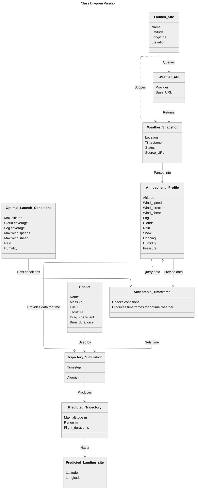

```mermaid
---
title: Class Diagram Paralax
config:
    layout: elk
    look: classic
    theme: neutral
    class:
        hideEmptyMembersBox: true
---
classDiagram
    class Rocket{
        Name
        Mass kg
        Fuel L
        Thrust N
        Drag_coefficient
        Burn_duration s
    }
    class Optimal_Launch_Conditions{
        Max altitude
        Cloud coverage
        Fog coverage
        Max wind speeds
        Max wind shear
        Rain
        Humidity    
    }
    class Acceptable_Timeframe{
        Checks conditions
        Produces timeframes for optimal weather
    }
    class Trajectory_Simulation{
        Algorithm()
        Timestep
    }
    class Predicted_Trajectory{
        Max_altitude m
        Range m
        Flight_duration s
    }
    class Predicted_Landing_site{
        Latitude
        Longitude
    }
    class Launch_Site{
        Name
        Latitude
        Longitude
        Elevation
    }
    class Weather_API{
        Provider
        Base_URL        
    }
    class Weather_Snapshot{
        Location
        Timestamp
        Status
        Source_URL
    }
    class Atmospheric_Profile{
        Altitude
        Wind_speed
        Wind_direction
        Wind_shear
        Fog
        Clouds
        Rain
        Snow
        Lighning
        Humidity
        Pressure
    }

    Launch_Site --> Weather_API : Queries
    Weather_API --> Weather_Snapshot : Returns
    Launch_Site ..> Weather_Snapshot : Scopes
    Weather_Snapshot --> Atmospheric_Profile : Parsed into
    Rocket --> Trajectory_Simulation : Used by
    Atmospheric_Profile --> Acceptable_Timeframe : Provide data
    Atmospheric_Profile <.. Acceptable_Timeframe : Query data
    Acceptable_Timeframe --> Trajectory_Simulation : Sets time
    Atmospheric_Profile --> Trajectory_Simulation : Provides data for time
    Trajectory_Simulation --> Predicted_Trajectory : Produces
    Predicted_Trajectory --> Predicted_Landing_site : Has a
    Optimal_Launch_Conditions --> Acceptable_Timeframe : Sets conditions


```    