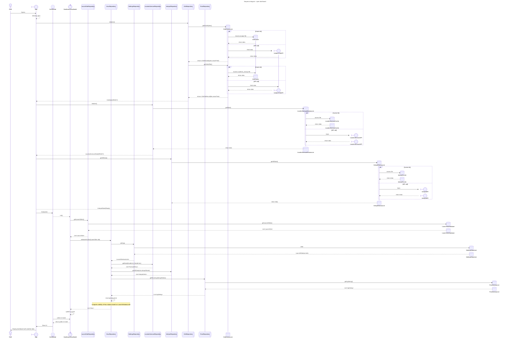

```mermaid
---
title: Sequence diagram - open dashboard
---
    sequenceDiagram

        actor User
        participant App@{"type":"boundary"}
        participant Dashboard@{"type":"entity"}
        participant DashboardViewModel@{"type":"control"}
        participant LaunchSiteRepository@{"type":"queue"}
        participant HourRepository@{"type":"queue"}
        participant SettingsRepository@{"type":"queue"}
        participant LocationforecastRepository@{"type":"queue"}
        participant InterpolRepository@{"type":"queue"}
        participant GribRepository@{"type":"queue"}
        participant FrostRepository@{"type":"queue"}

            User ->> App: Opens
            App -->> App: Intitialize data
            App ->> GribRepository: initialize()
            create participant GribDatasource@{"type":"database"}
            GribRepository ->> GribDatasource: getGrib1Bytes()
            alt Cache hit
                create participant GribCache@{"type":"database"}
                GribDatasource ->> GribCache: Access europe file
                GribCache -->> GribDatasource: return data
            else API call
                create participant IsobaricGribAPI@{"type":"boundary"}
                GribDatasource ->> IsobaricGribAPI: fetch data
                IsobaricGribAPI -->> GribDatasource: return data
            end
            GribDatasource -->> GribRepository: returns GribResult(bytes,actualTime)
            GribRepository ->> GribDatasource: getGrib2File()
            alt Cache hit
                GribDatasource ->> GribCache: Access southern_norway file
                destroy GribCache
                GribCache -->> GribDatasource: return data
            else API call
                GribDatasource ->> IsobaricGribAPI: fetch data
                destroy IsobaricGribAPI
                IsobaricGribAPI -->> GribDatasource: return data
            end
            GribDatasource -->> GribRepository: returns GribFileResult(file,actualTime)
            GribRepository -->> App: GribState(READY)

            App ->> LocationforecastRepository: initalize()
            create participant LocationforecastDatasource@{"type":"database"}
            LocationforecastRepository ->> LocationforecastDatasource: getData()
            alt Cache Hit
                create participant LocationforecastCache@{"type":"database"}
                LocationforecastDatasource ->> LocationforecastCache: access file
                destroy LocationforecastCache
                LocationforecastCache -->> LocationforecastDatasource: return data
            else API call
                create participant LocationforecastAPI@{"type":"boundary"}
                LocationforecastDatasource ->> LocationforecastAPI: fetch
                destroy LocationforecastAPI
                LocationforecastAPI -->> LocationforecastDatasource: return data
            end
            destroy LocationforecastDatasource
            LocationforecastDatasource -->> LocationforecastRepository: return data
            LocationforecastRepository -->> App: LocationforecastState(READY)

            App ->> InterpolRepository: getAllData()
            create participant InterpolDatasource@{"type":"database"}
            InterpolRepository ->> InterpolDatasource: getAllData()
            alt Cache Hit
                create participant InterpolCache@{"type":"database"}
                InterpolDatasource ->> InterpolCache: access file
                destroy InterpolCache
                InterpolCache -->> InterpolDatasource: return data
            else API call
                create participant InterpolAPI@{"type":"boundary"}
                InterpolDatasource ->> InterpolAPI: fetch
                destroy InterpolAPI
                InterpolAPI -->> InterpolDatasource: return data
            end
            destroy InterpolDatasource
            InterpolDatasource -->> InterpolRepository: data ready
            InterpolRepository --> App: InterpolState(Ready)

            App ->> Dashboard: Composes
            Dashboard -->> DashboardViewModel: init()
            DashboardViewModel ->> LaunchSiteRepository: getLaunchSites()
            create participant LaunchSiteDatabase@{"type":"database"}
            LaunchSiteRepository ->> LaunchSiteDatabase: getLaunchSites()
            destroy LaunchSiteDatabase
            LaunchSiteDatabase -->> LaunchSiteRepository: List<LaunchSite>
            LaunchSiteRepository -->> DashboardViewModel: List<LaunchSite>
            DashboardViewModel ->> HourRepository: initializeForSite(LaunchSite site)

            HourRepository ->> SettingsRepository: .settings
            create participant SettingsDatastore@{"type":"database"}
            SettingsRepository ->> SettingsDatastore: .data
            destroy SettingsDatastore
            SettingsDatastore -->> SettingsRepository: LaunchWindowLimits
            SettingsRepository -->> HourRepository: LaunchWindowLimits

            HourRepository ->> LocationforecastRepository: getData(Double lat, Double lon)
            LocationforecastRepository -->> HourRepository: List<ForecastEntry>

            HourRepository ->> InterpolRepository: getAllData(site.interpolName)
            InterpolRepository -->> HourRepository: List<InterpolUnits>

            HourRepository ->> FrostRepository: getRecenLightningStrikes()
            create participant FrostDatasource@{"type":"database"}
            FrostRepository ->> FrostDatasource: getLightning()
            destroy FrostDatasource
            FrostDatasource -->> FrostRepository: List<Lightning>
            FrostRepository -->> HourRepository: List<Lightning>

            HourRepository ->> HourRepository: recomputeScores() 
            Note over HourRepository: computes viability of Hour objects based on LaunchWindowLimits
            HourRepository -->> DashboardViewModel: List<Hour>

            DashboardViewModel ->> DashboardViewModel: update UI state

            Dashboard ->> DashboardViewModel: collect UI state
            DashboardViewModel -->> Dashboard: return public UI state

            Dashboard ->> App: Draw UI
            App ->> User: Display dashboard with weather data
            

```