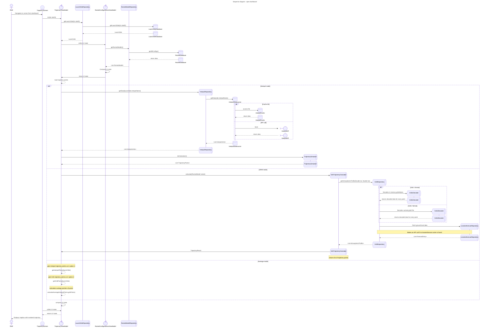

```mermaid
---
title: Sequence diagram - open dashboard
---
    sequenceDiagram
        actor User
        participant TrajectoryScreen@{"type":"entity"}
        participant TrajectoryViewModel@{"type":"control"}
        participant LaunchSiteRepository@{"type":"queue"}
        participant RocketConfigurationsViewModel@{"type":"control"}
        participant RocketModelRepository@{"type":"queue"}

        User ->> TrajectoryScreen: Navigates to screen from dashboard
        TrajectoryScreen ->> TrajectoryViewModel: init(int siteID)
        TrajectoryViewModel ->> LaunchSiteRepository: getLaunchSite(Int siteID)
        create participant LaunchSiteDatabase@{"type":"database"}
        LaunchSiteRepository ->> LaunchSiteDatabase: getLaunchSite(Int siteID)
        destroy LaunchSiteDatabase
        LaunchSiteDatabase -->> LaunchSiteRepository: LaunchSite
        LaunchSiteRepository -->> TrajectoryViewModel: Launchsite
        TrajectoryViewModel ->> RocketConfigurationsViewModel: collect UI state
        RocketConfigurationsViewModel ->> RocketModelRepository: getRocketModels()
        create participant RocketDatabase@{"type":"database"}
        RocketModelRepository ->> RocketDatabase: getAllConfigs()
        destroy RocketDatabase
        RocketDatabase -->> RocketModelRepository: return data
        RocketModelRepository -->>RocketConfigurationsViewModel: List<RocketModel>
        RocketConfigurationsViewModel ->> RocketConfigurationsViewModel: Compose UI state
        RocketConfigurationsViewModel ->> TrajectoryViewModel: return UI state

        TrajectoryViewModel -->> TrajectoryViewModel: load trajectory points

        alt Interpol mode
            create participant InterpolRepository@{"type":"queue"}
            TrajectoryViewModel ->> InterpolRepository: getData(launchSite.interpolName)
            create participant InterpolDatasource@{"type":"database"}
            InterpolRepository ->> InterpolDatasource: getData(site.interpolName)
            alt Cache Hit
                create participant InterpolCache@{"type":"database"}
                InterpolDatasource ->> InterpolCache: access file
                destroy InterpolCache
                InterpolCache -->> InterpolDatasource: return data
            else API call
                create participant InterpolAPI@{"type":"boundary"}
                InterpolDatasource ->> InterpolAPI: fetch
                destroy InterpolAPI
                InterpolAPI -->> InterpolDatasource: return data
            end
            destroy InterpolDatasource
            InterpolDatasource -->> InterpolRepository: List<InterpolUnits>
            destroy InterpolRepository
            InterpolRepository -->> TrajectoryViewModel: List<InterpolUnits>
            create participant TrajectorySimulator@{"type":"queue"}
            TrajectoryViewModel ->> TrajectorySimulator: doCalculaion()
            destroy TrajectorySimulator
            TrajectorySimulator -->> TrajectoryViewModel: List<TrajectoryPoints>
        else GRIB mode
            create participant GribTrajectoryCalculator@{"type":"queue"}
            TrajectoryViewModel ->> GribTrajectoryCalculator: calculate(RocketModel rocket)
            create participant GribRepository@{"type":"queue"}
            GribTrajectoryCalculator ->> GribRepository: getAtmosphericProfile(Double lat, Double lon)
            alt Grib 1 format
                create participant Grib1Decoder@{"type":"queue"}
                GribRepository ->> Grib1Decoder: Decodes in-memory grib1Bytes
                destroy Grib1Decoder
                Grib1Decoder -->> GribRepository: returns decoded data for every point 
            else Grib 2 format
                create participant Grib2Decoder@{"type":"queue"}
                GribRepository ->> Grib2Decoder: Decodes cached grib2 file
                destroy Grib2Decoder
                Grib2Decoder -->> GribRepository: returns decoded data for every point 
            end
            create participant LocationforecastRepository@{"type":"queue"}
            GribRepository ->> LocationforecastRepository: Fetch ground level data
            Note over GribRepository,LocationforecastRepository: Makes an API call if no locatonforecast cache is found
            destroy LocationforecastRepository
            LocationforecastRepository -->> GribRepository: List<ForecastEntry>
            destroy GribRepository
            GribRepository -->> GribTrajectoryCalculator: List<AtmosphericProfile>
            destroy GribTrajectoryCalculator
            GribTrajectoryCalculator ->> TrajectoryViewModel: TrajectoryResult
            Note over GribTrajectoryCalculator: returns list of trajectory points
        else Average mode
            Note over TrajectoryViewModel: gets Interpol trajectory points as in option 1
            TrajectoryViewModel -->> TrajectoryViewModel: getInterpolPoints(launchSite)
            Note over TrajectoryViewModel: gets Grib trajectory points as in option 2
            TrajectoryViewModel -->> TrajectoryViewModel: getGribPoints(launchSite)
            Note over TrajectoryViewModel: calculates average position of points
            TrajectoryViewModel -->> TrajectoryViewModel: calculateAverage(interpolPoints,gribPoints)
        end

        TrajectoryViewModel ->> TrajectoryViewModel: compose UI state
        TrajectoryScreen ->> TrajectoryViewModel: collect UI state
        TrajectoryViewModel -->> TrajectoryScreen: returns UI state
        TrajectoryScreen -->> User: Displays mapbox with rendered trajectory


```