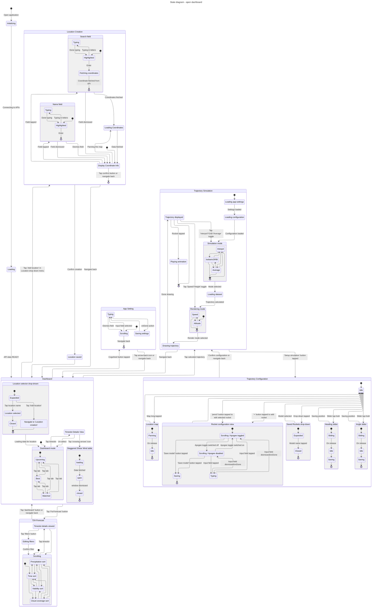

```mermaid
---
title: State diagram - open dashboard
config:
    layout: elk
    look: classic
    theme: natural
---

stateDiagram-v2
   D: Dashboard
   S: App Setting
   F: 72H Forecast
   LS: Location Creation
   LSS: Location saved
   T: Trajectory Simulation
   TCF: Trajectory Configuration


    [*] --> Initalizing : Open application
    Initalizing --> Loading: Connecting to APIs
    Loading --> D: API data READY
    state D {
        DM: Dashboard mode
        DT: Timeslot Details View
        DST: Staggered Shear Wind table
        DLDD: Location selector drop-drown

        [*] --> DM
        state DM {
            D1: Upcoming
            D2: Best
            D3: Watched
            [*] -->D1
            D1 --> D2: Tap tab
            D1 --> D3: Tap tab
            D2 --> D1: Tap tab
            D2 --> D3: Tap tab
            D3 --> D1: Tap tab
            D3 --> D2: Tap tab
        }
        DM --> DT: Tap timeslot
        DT --> DM: Un-select
        DT --> DST: Tap 'crossing arrows' icon
        state DST {
            L: loading
            O: open
            C: closed
            [*] --> L
            L --> O: Data fetched
            O --> C: window dismissed
            C --> [*]
        }
        state DLDD {
            DD1: Expanded
            DD2: Closed
            DD3: Navigate to 'Location creation'
            DD4: Location selected

            [*] --> DD1
            DD1 --> DD3: Tap 'Add location'
            DD1 --> DD4: Tap location name
            DD3 --> [*]
            DD4 --> DD2
            DD2 --> [*]

        }
        DLDD --> DM: Loading data for location

    }

    D --> LS: Tap 'Add location' in Location drop down menu
    state LS {
        LoadCoor: Loading Coordinates
        DispCoor: Display Coordinate Info
        SBar: Search field
        NBar: Name field

        [*] --> DispCoor
        DispCoor --> LoadCoor: Panning the map
        LoadCoor --> DispCoor: Data fetched

        DispCoor --> SBar: Field tapped
        SBar --> DispCoor: Field dismissed
        state SBar {
            fetchCoor: Fetching coordinates
            [*] --> Highlighted
            Highlighted --> Typing: Typing in letters
            Typing --> Highlighted: Done typing
            Highlighted --> fetchCoor: Enter
            fetchCoor --> [*]: Coordinate fetched from API
        }
        SBar --> LoadCoor: Coordinates fetched

        DispCoor --> NBar: Field tapped
        NBar --> DispCoor: Field dismissed
        state NBar {
            nameH: Highlighted
            nameT: Typing
            [*] --> nameH
            nameH --> nameT: Typing in letters
            nameT --> nameH: Done typing
            nameH --> [*]: Enter
        }
        NBar --> DispCoor: Dismiss field

        DispCoor --> [*]: Tap confirm button or navigate back
    }
    LS --> LSS: Confirm creation
    LSS --> D
    LS --> D: Navigate back


    D --> S: Cogwheel button tapped
    state S {
        ST: Typing
        SS: Scrolling
        SV: Saving settings

        [*] --> SS
        SS --> ST: Input field selected
        ST --> SS: Dismiss field
        ST --> SV: onDone action
        SV --> ST
        SS --> [*]: Navigate back
    }
    S --> D: Tap arrow-back icon or navigate back

    D --> F: Tap 'Full forecast' button
    state F {
        FS: Scrolling
        FTS: Timeslot details viewed
        FFE: Editing filters

        [*] --> FS
        state FS {
            VS: Viability sort
            CS: Cloud coverage sort
            PS: Precipitation sort
            TS: Time sort
            [*] --> TS
            TS --> VS 
            VS --> TS
            TS --> PS
            PS --> TS
            TS --> CS
            CS --> TS
            VS --> CS
            VS --> PS
            PS --> VS
            PS --> CS
            CS --> PS
            CS --> VS
        }
        FS --> FTS: Tap timeslot
        FTS --> FS
        FTS --> FFE: Tap 'filters' button
        FFE --> FS: Confirm filter
    }
    F --> D: Tap 'dashboard' button or navigate back

    D --> T: Tap calculate trajectory
    state T {
        TMode: Simulation mode
        TRMode: Rendering mode
        TLS: Loading app-settings
        TLC: Loading configuration
        TLD: Loading dataset
        TRend: Drawing trajectory
        TDisp: Trajectory displayed
        TPlay: Playing animation

        [*] --> TLS
        TLS --> TLC: Settings loaded
        TLC --> TMode: Configuration loaded
        state TMode {
            ModeI: Interpol
            ModeG: IsobaricGRIB
            ModeA: Average

            ModeI --> ModeG
            ModeI --> ModeA
            ModeG --> ModeI
            ModeG --> ModeA
            ModeA --> ModeI
            ModeA --> ModeG

            ModeI -->[*]
            ModeG -->[*]
            ModeA -->[*]
        }
        TMode --> TLD: Mode selected 
        TLD --> TRMode: Trajectory calculated
        state TRMode {
            TRModeA: Altitude
            TRModeS: Speed
            [*] --> TRModeA
            TRModeA --> TRModeS
            TRModeS --> TRModeA
            TRModeA --> [*]
            TRModeS --> [*]
        }
        TRMode --> TRend: Render mode selected
        TRend --> TDisp: Done drawing
        TDisp --> TRMode: Tap 'Speed'/'Height' toggle
        TDisp --> TMode: Tap 'Interpol'/'Grib'/'Average' toggle
        TDisp --> TPlay: Rocket tapped
        TDisp --> [*]
        TPlay --> [*]
    }
    T --> D: Navigate back

    T --> TCF: 'Setup simulation' button tapped
    state TCF {
        TCFIdle: Idle
        RDD: Saved Rockets drop-down
        RCV: Rocket configuration view
        TCFMap: Location map
        TCFAngle: Angle slider
        TCFHeading: Heading slider
        [*] --> TCFIdle
        TCFIdle --> RCV: '+' button tapped to add rocket
        TCFIdle --> RCV: 'pencil' button tapped to edit selected rocket
        state RCV {
            RCVScrollA: Scrolling / Apogee toggled
            RCVScrollD: Scrolling / Apogee disabled
            RCVType: Typing
            RCVSave: Saving
            [*] --> RCVScrollA
            RCVScrollA --> RCVScrollD: Apogee toggle switched off
            RCVScrollD --> RCVScrollA: Apogee toggle switched on
            RCVScrollA --> RCVType: Input field tapped
            RCVType --> RCVScrollA: Input field dismissed/onDone
            RCVScrollD --> RCVType: Input field tapped
            RCVType --> RCVScrollD: Input field dismissed/onDone
            RCVScrollA --> RCVSave: 'Save model' button tapped
            RCVScrollD --> RCVSave: 'Save model' button tapped
            RCVSave --> [*]
        }
        RCV --> TCFIdle
        TCFIdle --> RDD: Drop-down tapped
        state RDD {
            RDDExp: Expanded
            RDDClose: Closed
            [*] --> RDDExp
            RDDExp --> RDDClose: Model name tapped
            RDDClose --> [*]
        }
        RDD --> TCFIdle: Model selected
        TCFIdle --> TCFAngle: Slider tap-hold
        state TCFAngle {
            TCFAngleSlide: Sliding
            TCFAngleStop: Idle
            TCFAngleSave:Saving
            [*] --> TCFAngleSlide
            TCFAngleSlide --> TCFAngleStop: On release
            TCFAngleStop --> TCFAngleSave
            TCFAngleSave --> [*]
        }
        TCFAngle --> TCFIdle: Saving position
        TCFIdle --> TCFHeading: Slider tap-hold
        state TCFHeading {
            TCFHeadingSlide: Sliding
            TCFHeadingStop: Idle
            TCFHeadingSave:Saving
            [*] --> TCFHeadingSlide
            TCFHeadingSlide --> TCFHeadingStop: On release
            TCFHeadingStop --> TCFHeadingSave
            TCFHeadingSave --> [*]
        }
        TCFHeading --> TCFIdle: Saving position
        TCFIdle --> TCFMap: Map long-tapped
        state TCFMap {
            [*] --> Panning
            Panning --> Idle: On release
            Idle --> [*]
        }
        TCFMap --> TCFIdle
    }
    TCF --> T: Confirm configuration or navigate back


```